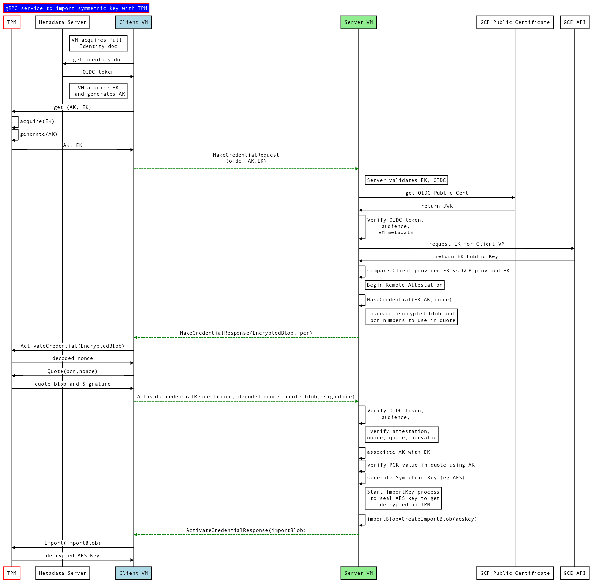
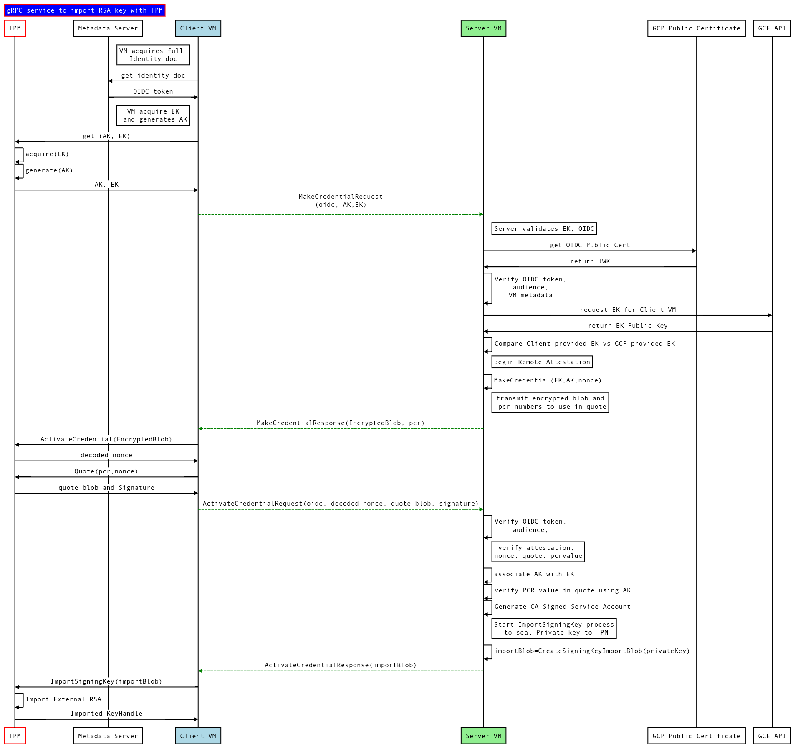
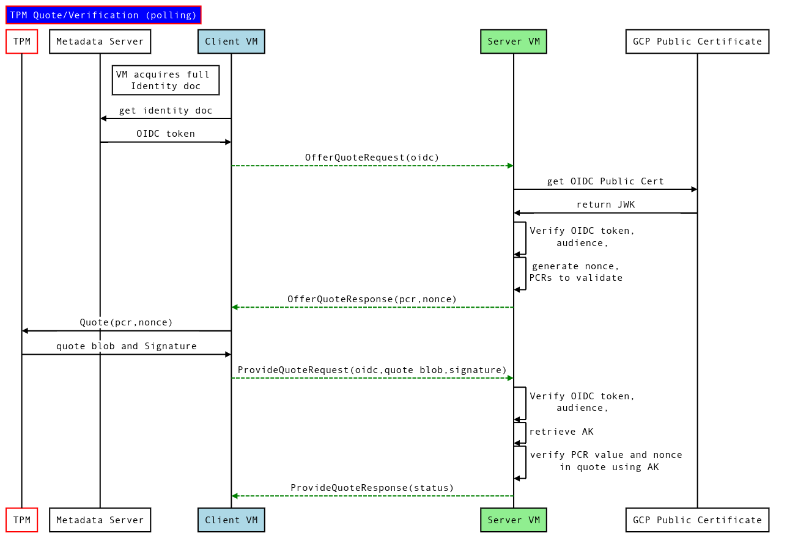

# TPM based Secret Sharing with on Google Compute Engine

Symmetric and Asymmetric Key Distribution server using [Trusted Platform Module](https://en.wikipedia.org/wiki/Trusted_Platform_Module).

This repo contains a sample `gRPC` client server application that distributes a symmetric or asymmetric key from a server to a client.

>>> **NOTE** the code and procedure outlined here is **NOT** supported by google.  It is just something i was interested.  _caveat emptor_

There are two parts:

* `server`:  a `gRPC` server which accepts connections from a client, validates the client's TPM and system state, then securely distributes a key to that client.  The key is distributed such that it can _only_ get loaded or decoded on the client that has the TPM

* `client`: a `gRPC` client which connects to the corresponding server, proves it owns a specific TPM and then receives a sealed Key that can only be decoded by that client.


The idea is the gRPC service acts like a broker to distribute secrets to clients VM only after they prove their integrity and state using the TPM.


There are several sequences involved in this flow which uses the TPM:

* Proof that a client owns a specific TPM [Remote Attestation](https://tpm2-software.github.io/tpm2-tss/getting-started/2019/12/18/Remote-Attestation.html)
* Proof that the client is in a specific TPM State [Quote-Verify](https://github.com/salrashid123/tpm2/tree/master/quote_verify)
* Secure Transfer of Key from the server to the client
* Side channel proof the client has the specific TPM using Google Cloud APIs

The basic flow as a story is like this:

1. Client wants to get a secret (eg, RSA or AES key) from a Server

2. Client asks its TPM for its `Endorsement Key` (`EK`) and to create an `Attestation Key` (`AK`).  The endorsement key is an encryption-only key tied to that specific TPM.  The attestation key is a signing key that can be used to demonstrate a the clients system state (i.,e its used to sign a [Quote](https://github.com/tpm2-software/tpm2-tools/blob/master/man/tpm2_quote.1.md).  The client needs to first prove that its attestation key it gives to the server is associate with an endorsement key.

3. Client connects to server using TLS and provides its Google Cloud VM's [identity document](https://cloud.google.com/compute/docs/instances/verifying-instance-identity) as an authentication header.  The Identity document is an Google CA signed JWT that contains data that uniquely identifies the VM (Instance Name, instanceID, where it is running, etc).  Client sends its `EK` and `AK` _Public Key_.  The API endpoint on the server here is: `MakeCredential()`.

3. Server verifies the identity document is signed by Google and it also extracts the JWT Claims embedded in the Token.  The server will make a decision based ont the claims if its a legitimate client API request (i.,e is the VM instance or project even allowed to get a secret in the first place)

4. Server uses GCP API call using the instanceID to retrieve its version of the Endorsement Key
   `gcloud compute instances get-shielded-identity <instanceID> --format="value(encryptionKey.ekPub)"`

5. Server compares the GCP provided Endorsement Key's public part to the one provided by the client.  if they match, then the server knows the EK is atleast coming from that VM.

6. Server uses the `EK` public cert, and the "name" of the `AK` to encrypt a nonce.

7. Server sends the encrypted nonce back to the client and also asks its to provide proof about a current state of a PCR. 

8. Client uses the `EK` and `AK` to decrypt the nonce.

9. Client asks the TPM to generate a `Quote` against the PCR back requested by the server.  The Quote contains the value of the PCR bank at that moment.

10. Client makes another API call to the sever (which again includes the `id_document`).  The client sends the Quote value and the decrypted nonce. The API endpoint on the server is `ActivateCredential()`.

11. Server verifies the nonce matches what it originally encrypted.  Once that is done, it knows the `EK`, `AK` that it used to wrap a secret must be present on the client.   Server permanently associates the AK with that EK.  

12. Server verifies the Quote is singed by that AK (which is now trusted). Server checks what the attested PCR values are in the Quote.  If the PCR values are what it expects, it knows the client is in a known integrity state.


At this point, the server can distribute two types of keys Asymmetric (`RSA`) or Symmetric (eg `AES` key).  

do one of:

`RSA`:

13. Server generates `RSA` private key for this client.  It can either download a [GCP Service Account private key](https://cloud.google.com/iam/docs/creating-managing-service-account-keys#creating_service_account_keys) or ask any CA to generate a key and sign it optionally.  The server will only transfer an RSA Private key portion.

14. Server encrypts the `RSA` key using a procedure that seals it using the EK  ([CreateSigningKeyImportBlob](https://github.com/google/go-tpm-tools/blob/master/server/import.go#L38)) and optionally provides a set of PCR values.  The RSA key can only be loaded into the TPM that owns the `EK` and will load if the specific PCR hash is present on a given bank.  This ensures the key is bound to the client's state.

15. Server sends the encrypted RSA key to the client

16. Client uses its TPM to load the encrypted key into its TPM ([tpm2tools.Key.ImportSigningKey](https://godoc.org/github.com/google/go-tpm-tools/tpm2tools#Key.ImportSigningKey)).  The imported key is _not_ exportable and can only be asked to sign anything through that TPM


`AES`:

17. Server seals a symmetric key using the `EK`  ([CreateImportBlob](https://github.com/google/go-tpm-tools/blob/master/server/import.go#L57).  The key here is a static sequence that happens to be an AES256 key but  more generally, any bit of data (passphrase, symmetric key) can be sealed to the EK such that only a given TPM can decode it.  Optionally provide PCR values during sealing such that the key will only get decrypted if the PCR values exist on the TPM.

18. Server sends the encrypted key to the client

19. Client uses its TPM to decrypt the secret key using the TPM. ([tpm2tools.Key.Import](https://godoc.org/github.com/google/go-tpm-tools/tpm2tools#Key.Import))


At this point, the server transferred an RSA private key or an arbitrary key to the client in a way that ensures the client was confirmed to be in a specific state.


`Quote-Verify`:

Now that the server trusts the `AK`, the client can proove its current state at anytime to the server.  Since this is a client->server flow, the client has to initiate the proof.   

20. Client needs to prove its state to the server and makes a gRPC API call to the server (`OfferQuote()`)

21. Server responds back to the client and uses the AK it now trusts with nonce and list of PCR bank to Quote.  The nonce is there just to prevent replay.

22. Client asks its TPM to generate a `Quote` using the `AK` and to include the nonce value and PCR bank state in the quote

23. Client sends the Quote and the TPM-AK signed values for the quote to the server (`ProvideQuote()`)

24. Server uses its AK public certificate to verify the Quote and inspect the PCR values.  It will also check the nonce is included in the quote.

The client has indirectly now proven its PCR state to the Server

### Flow Diagram

#### Remote Attestation with Symmetric Key import



#### Remote Attestation with Asymmetric Key import



#### Quote-Verify




### References

- [A Practical Guide to TPM 2.0](https://link.springer.com/book/10.1007/978-1-4302-6584-9)
- [tpm2-software community Remote Attestation](https://tpm2-software.github.io/tpm2-tss/getting-started/2019/12/18/Remote-Attestation.html)
- [StackOverflow: Can I prove the relation between AIK and EK without asking to the TPM 2.0?](https://security.stackexchange.com/questions/197794/can-i-prove-the-relation-between-aik-and-ek-without-asking-to-the-tpm-2-0)
- [Virtual Trusted Platform Module for Shielded VMs: security in plaintext](https://cloud.google.com/blog/products/gcp/virtual-trusted-platform-module-for-shielded-vms-security-in-plaintext)

- Go Implementations/Samples:
  - Import Symmetric Key: [ek_import_blob](https://github.com/salrashid123/tpm2/tree/master/ek_import_blob)
  - Import RSA Key: [ek_import_rsa_blob](https://github.com/salrashid123/tpm2/tree/master/ek_import_rsa_blob)
  - Quote/Verify: [quote_verify](https://github.com/salrashid123/tpm2/tree/master/quote_verify)
  - MakeCredential/ActivateCredential: [tpm_make_activate](https://github.com/salrashid123/tpm2/tree/master/tpm_make_activate)


### Usage

#### Create GCE Shielded VM and Service Accounts

```bash
export PROJECT_ID=$(gcloud config list --format="value(core.project)")
export PROJECT_NUMBER=`gcloud projects describe $PROJECT_ID --format="value(projectNumber)"`
export SERVER_SERVICE_ACCOUNT=tpm-server@$PROJECT_ID.iam.gserviceaccount.com
export CLIENT_SERVICE_ACCOUNT=tpm-client@$PROJECT_ID.iam.gserviceaccount.com

gcloud iam service-accounts create tpm-client
gcloud iam service-accounts create tpm-server
```

Service Accounts:

- `tpm-client` service account will not have any IAM permissions and will only provide the gRPC Server the instance identity document.

- `tpm-server` service account will use the GCE API call to recall the clients public endorsement key

```bash
$ gcloud compute  instances create client \
  --service-account=$CLIENT_SERVICE_ACCOUNT \
  --scopes=email  --image=ubuntu-1804-bionic-v20200317 \
  --machine-type "n1-standard-1" --image-project=gce-uefi-images \
  --shielded-secure-boot --shielded-vtpm --shielded-integrity-monitoring  \
  --zone us-central1-a --tags=client


$ gcloud compute  instances create server \
  --service-account=$SERVER_SERVICE_ACCOUNT \
  --scopes=compute-ro,email  --image=ubuntu-1804-bionic-v20200317 \
  --machine-type "n1-standard-1" --image-project=gce-uefi-images \
  --shielded-secure-boot --shielded-vtpm --shielded-integrity-monitoring  \
  --zone us-central1-a --tags=server

NAME    ZONE           MACHINE_TYPE   PREEMPTIBLE  INTERNAL_IP   EXTERNAL_IP     STATUS
server  us-central1-a  n1-standard-1               10.128.0.121  104.154.44.141  RUNNING
```

Note down the internalIP for the `server`: `10.128.0.121`.  This address will be used later to make the gRPC connection

#### Allow server read access to client's metadata

Create a policy file (verify `$SERVER_SERVICE_ACCOUNT` is still active in the current shell)

```bash
cat <<EOF > policy.json
bindings:
- members:
  - serviceAccount:$SERVER_SERVICE_ACCOUNT
  role: roles/compute.viewer
version: 1
EOF

$ gcloud compute instances set-iam-policy client policy.json -q
```

#### Generate client, server
```
```bash
go build src/grpc_server.go
go build src/grpc_client.go
```

#### Copy certificates and binary to client/server

```bash
gcloud compute scp certs/CA_crt.pem client:
gcloud compute scp certs/client_crt.pem client:
gcloud compute scp certs/client_key.pem client:
gcloud compute scp grpc_client client:

gcloud compute scp certs/CA_crt.pem server:
gcloud compute scp certs/CA_key.pem server:
gcloud compute scp certs/server_crt.pem server:
gcloud compute scp certs/server_key.pem server:
gcloud compute scp grpc_server server:
```

#### Edit /etc/hosts on client

- Add to `/etc/hosts` on ssh client

```bash
gcloud compute ssh client

add to /etc/hosts
10.128.0.121 verify.esodemoapp2.com
```

### AES mode

In this mode, an simple AES key will be securely tranferred from the server to the client

#### SERVER

on the server, start the grpc service.  Instruct it to seal against `pcr=0` on the client and expect its value to be `fcecb56acc303862b30eb342c4990beb50b5e0ab89722449c2d9a73f37b019fe`.

Note, that PCR value is the default PCR=0 value for a Google Compute Shielded VM

```bash
gcloud compute ssh server

sudo ./grpc_server  --grpcport :50051 -pcr 0 -secret bar -expectedPCRValue fcecb56acc303862b30eb342c4990beb50b5e0ab89722449c2d9a73f37b019fe --importMode=AES --v=5 -alsologtostderr
```

#### Client

Run the client. 

You can specify any `uid` value there (its just a unique self-identifier)

```bash
sudo ./grpc_client --uid 369c327d-ad1f-401c-aa91-d9b0e69bft67 --unsealPcr=0 --host verify.esodemoapp2.com:50051 --importMode=AES  --v=5 -alsologtostderr
```

---

**Sample Output:**

```bash
$ sudo ./grpc_server  --grpcport :50051 -pcr 0 -secret bar -expectedPCRValue fcecb56acc303862b30eb342c4990beb50b5e0ab89722449c2d9a73f37b019fe --importMode=AES  --v=10 -alsologtostderr

      I0417 20:12:28.682204    3032 grpc_server.go:287] Starting gRPC server on port :50051
      I0417 20:12:34.009761    3032 grpc_server.go:156] >> authenticating inbound request
      I0417 20:12:34.010246    3032 grpc_server.go:318] OIDC doc has Audience [grpc://verify.esodemoapp2.com]   Issuer [https://accounts.google.com]
      I0417 20:12:34.010323    3032 grpc_server.go:182] HealthCheck called for Service [verifier.VerifierServer]
      I0417 20:12:34.152047    3032 grpc_server.go:156] >> authenticating inbound request
      I0417 20:12:34.152429    3032 grpc_server.go:318] OIDC doc has Audience [grpc://verify.esodemoapp2.com]   Issuer [https://accounts.google.com]
      I0417 20:12:34.152512    3032 grpc_server.go:326] ======= MakeCredential ========
      I0417 20:12:34.152573    3032 grpc_server.go:327]      client provided uid: 369c327d-ad1f-401c-aa91-d9b0e69bft67
      I0417 20:12:34.152624    3032 grpc_server.go:328]      Got AKName 000b3c2e39b8684316a8247ec3e29a83559c5af24e7dd20f7d25f05a368c891a1e2b
      I0417 20:12:34.152685    3032 grpc_server.go:329]      Registry size 0
      I0417 20:12:34.152727    3032 grpc_server.go:332]      From InstanceID 8769433075726138788
      I0417 20:12:34.343013    3032 grpc_server.go:347]      Acquired PublickKey from GCP API: 
      -----BEGIN PUBLIC KEY-----
      MIIBIjANBgkqhkiG9w0BAQEFAAOCAQ8AMIIBCgKCAQEA1i3ezqB/xqzQ8yp9zg5F
      tvJDSUmsvvYIIMtSmtewRqmzjXRuX7QZ9XaQ1x1eaFGXF/MYdGz3s7sSPu1ED7MI
      oqJqFvd8d1vYa+QHhrSDM1o48scDbesI05hLlWs42yp9YpZKoBw+sW2e8b75yGYH
      IKeu1vnhPMFzri9uej17cHsU/mCjPT/gyioTQLRd1jYxtVFz5NgKjXQavKUE9BEN
      +GneaqWnKOmyq8guEg4bcdySuHqGYMGdYgF1XoShAxHtAh1TvdEi7bTVuMOH13BJ
      1F      I0417 20:14:27.339955    3068 grpc_server.go:287] Starting gRPC server on port :50051
      I0417 20:14:30.114640    3068 grpc_server.go:156] >> authenticating inbound request
      I0417 20:14:30.115098    3068 grpc_server.go:318] OIDC doc has Audience [grpc://verify.esodemoapp2.com]   Issuer [https://accounts.google.com]
      I0417 20:14:30.115173    3068 grpc_server.go:182] HealthCheck called for Service [verifier.VerifierServer]
      I0417 20:14:30.376136    3068 grpc_server.go:156] >> authenticating inbound request
      I0417 20:14:30.376594    3068 grpc_server.go:318] OIDC doc has Audience [grpc://verify.esodemoapp2.com]   Issuer [https://accounts.google.com]
      I0417 20:14:30.376675    3068 grpc_server.go:326] ======= MakeCredential ========
      I0417 20:14:30.376723    3068 grpc_server.go:327]      client provided uid: 369c327d-ad1f-401c-aa91-d9b0e69bft67
      I0417 20:14:30.376784    3068 grpc_server.go:328]      Got AKName 000b4e1e044138416444859bd35cd001ea2d2ffbba02c9f332507dcc78a66b5d8b1a
      I0417 20:14:30.376846    3068 grpc_server.go:329]      Registry size 0
      I0417 20:14:30.376890    3068 grpc_server.go:332]      From InstanceID 8769433075726138788
      I0417 20:14:30.548125    3068 grpc_server.go:347]      Acquired PublickKey from GCP API: 
      -----BEGIN PUBLIC KEY-----
      MIIBIjANBgkqhkiG9w0BAQEFAAOCAQ8AMIIBCgKCAQEA1i3ezqB/xqzQ8yp9zg5F
      tvJDSUmsvvYIIMtSmtewRqmzjXRuX7QZ9XaQ1x1eaFGXF/MYdGz3s7sSPu1ED7MI
      oqJqFvd8d1vYa+QHhrSDM1o48scDbesI05hLlWs42yp9YpZKoBw+sW2e8b75yGYH
      IKeu1vnhPMFzri9uej17cHsU/mCjPT/gyioTQLRd1jYxtVFz5NgKjXQavKUE9BEN
      +GneaqWnKOmyq8guEg4bcdySuHqGYMGdYgF1XoShAxHtAh1TvdEi7bTVuMOH13BJ
      1FY3wloNZgqS54Q11g1f3IxrKdAVq2D8G81oNhw0wr/T+ojpTwm5BQejGXhA6w6F
      kQIDAQAB
      -----END PUBLIC KEY-----
      I0417 20:14:30.548653    3068 grpc_server.go:349]      Decoding ekPub from client
      I0417 20:14:30.548776    3068 grpc_server.go:370]      EKPubPEM: 
      -----BEGIN PUBLIC KEY-----
      MIIBIjANBgkqhkiG9w0BAQEFAAOCAQ8AMIIBCgKCAQEA1i3ezqB/xqzQ8yp9zg5F
      tvJDSUmsvvYIIMtSmtewRqmzjXRuX7QZ9XaQ1x1eaFGXF/MYdGz3s7sSPu1ED7MI
      oqJqFvd8d1vYa+QHhrSDM1o48scDbesI05hLlWs42yp9YpZKoBw+sW2e8b75yGYH
      IKeu1vnhPMFzri9uej17cHsU/mCjPT/gyioTQLRd1jYxtVFz5NgKjXQavKUE9BEN
      +GneaqWnKOmyq8guEg4bcdySuHqGYMGdYgF1XoShAxHtAh1TvdEi7bTVuMOH13BJ
      1FY3wloNZgqS54Q11g1f3IxrKdAVq2D8G81oNhw0wr/T+ojpTwm5BQejGXhA6w6F
      kQIDAQAB
      -----END PUBLIC KEY-----
      I0417 20:14:30.549200    3068 grpc_server.go:376]      Verified EkPub from GCE API matches ekPub from Client
      I0417 20:14:30.549246    3068 grpc_server.go:562]      --> Starting makeCredential()
      I0417 20:14:30.549302    3068 grpc_server.go:563]      Read (ekPub) from request
      I0417 20:14:30.560057    3068 grpc_server.go:576]      Read (akPub) from request
      I0417 20:14:30.560281    3068 grpc_server.go:598]      Decoded AkPub: 
      -----BEGIN PUBLIC KEY-----
      MIIBIjANBgkqhkiG9w0BAQEFAAOCAQ8AMIIBCgKCAQEAxjN5y3yk8M+JwA5DdnoC
      xC9+eR0xrZLzA2xz/e8UxEkImPNc6goz6YLt9TJXFmCQpIbTn0VrY03+j2xhBh9p
      lzabH48GKMDW4Zk0UQtE+Q+IcEq+GJbhhbD+eWKaJjdsURIuz1DAE48sXLP49KKB
      IfNs9IHEeW4PZywsosAmsfDbVWZXTEZEYV4/QsIgru5Xp6behLsR4aOgM52xTin8
      5Pm9/Wrn1uQGxgiHgr1spupIDfXZwZ+Wq+4TvaVnwlfozO0t/pifjGUCdtryVKRz
      YYWJeH5XxezyGoCNySRDgsjTQVXkhP2Khw+XqskdJ5/YmdL49fJRKZXe4cU9XkHF
      bwIDAQAB
      -----END PUBLIC KEY-----
      I0417 20:14:30.560710    3068 grpc_server.go:601]      AK Default parameter match template
      I0417 20:14:30.564189    3068 grpc_server.go:610]      Loaded AK KeyName 000b4e1e044138416444859bd35cd001ea2d2ffbba02c9f332507dcc78a66b5d8b1a
      I0417 20:14:30.564315    3068 grpc_server.go:612]      MakeCredential Start
      I0417 20:14:30.567877    3068 grpc_server.go:618]      credBlob 0020c192b4a003a3b8f23a6ac56a0661f283a99680951b75048ca6b4a0eb62a57b23566a82bf24
      I0417 20:14:30.567976    3068 grpc_server.go:619]      encryptedSecret0 7a785718a8a6c3676f30443e657b0bff6b8905920685611f196bdd45afd77c3877ae713e11505f6631cd3878bb9007eb2c500852c550a7829fd6f0ef16dde2b4100e9e277f33ed8508423688743ab21ddc32f06d1a6bef9f56ce344e9c1b82810182e0bbd9e99d46ca57ab257bb41e5a861ad1e9c2c2df767f699019e3100e733cf4f2a754b094caa90e631b957def90c8ae1af3e3addc3741b38e2d6ffc124a7d3d60336cf76d232c6b1992caf34cad59e6a3f6dfe2aa6e2c4ff34335f46e15bf1d3ef5c04fed2078cb5d5585c92e7d916f5933e52a82393dfa6d6b9f3025d1ff0643ad86d2d543a935274b6dcb43b0abe3e14cf5555d15587e5bc7cb56d9c2
      I0417 20:14:30.568043    3068 grpc_server.go:620]      <-- End makeCredential()
      I0417 20:14:30.569796    3068 grpc_server.go:388]      Returning MakeCredentialResponse ========
      I0417 20:14:31.647121    3068 grpc_server.go:156] >> authenticating inbound request
      I0417 20:14:31.647466    3068 grpc_server.go:318] OIDC doc has Audience [grpc://verify.esodemoapp2.com]   Issuer [https://accounts.google.com]
      I0417 20:14:31.647538    3068 grpc_server.go:399] ======= ActivateCredential ========
      I0417 20:14:31.647596    3068 grpc_server.go:400]      client provided uid: 369c327d-ad1f-401c-aa91-d9b0e69bft67
      I0417 20:14:31.647639    3068 grpc_server.go:401]      Secret bar
      I0417 20:14:31.647699    3068 grpc_server.go:404]      From InstanceID 8769433075726138788
      I0417 20:14:31.647740    3068 grpc_server.go:503]      --> Starting verifyQuote()
      I0417 20:14:31.647798    3068 grpc_server.go:508]      Read and Decode (attestion)
      I0417 20:14:31.647877    3068 grpc_server.go:514]      Attestation ExtraData (nonce): bar 
      I0417 20:14:31.647938    3068 grpc_server.go:515]      Attestation PCR#: [0] 
      I0417 20:14:31.647986    3068 grpc_server.go:516]      Attestation Hash: 00e0758c418aff8b359dbcf0fb9af040ca15e973b02e5630b5dca1775c7e130a 
      I0417 20:14:31.648051    3068 grpc_server.go:533]      Expected PCR Value:           --> fcecb56acc303862b30eb342c4990beb50b5e0ab89722449c2d9a73f37b019fe
      I0417 20:14:31.648110    3068 grpc_server.go:534]      sha256 of Expected PCR Value: --> 00e0758c418aff8b359dbcf0fb9af040ca15e973b02e5630b5dca1775c7e130a
      I0417 20:14:31.648160    3068 grpc_server.go:536]      Decoding PublicKey for AK ========
      I0417 20:14:31.648325    3068 grpc_server.go:555]      Attestation Signature Verified 
      I0417 20:14:31.648377    3068 grpc_server.go:556]      <-- End verifyQuote()
      I0417 20:14:31.648435    3068 grpc_server.go:418]      Verified Quote
      I0417 20:14:31.648476    3068 grpc_server.go:625]      --> Start generateCertificate()
      I0417 20:14:31.648528    3068 grpc_server.go:626]      Generating Certificate for cn=8769433075726138788
      I0417 20:14:31.648751    3068 grpc_server.go:641]      Generated cert with Serial 408254118850144987185943855269412930169279703308
      I0417 20:14:31.894003    3068 grpc_server.go:704]      Generating Test Signature with private Key
      I0417 20:14:31.896706    3068 grpc_server.go:713]      Test signature data:  UGS+ASkuFl1ve5Df6jad4dNEZHMXeYu9PonGGzqtD7dOWQQiCk3R4doQXhxN6Ee61of86d0FODzfaEBaKSFBF0yDc9eq26zuTZG6XvgQVB8e8V4MgfRxO5go1iGEyn+R/G1XpmXZpnDGJFN14sXzejOcLXSkSQByrZL2KSdVb600PQMKmkEnQ5qSlR8hSKo5FNUU/sOEVtqbRHeeBLo697pEB14PnMosmlYL1Ve5Qkh5wFPAZ+2ePpk3C+2+9epA5dgsHwVLdoavSLI2nAp+xMJLm4h8IG7aA1RuyXiZpAwQw2md2QrPvR8r1xlEonTYgvVxmd75/wgTYSSd8x+FlQ
      I0417 20:14:31.896784    3068 grpc_server.go:714]      <-- End generateCertificate()
      I0417 20:14:31.896849    3068 grpc_server.go:719]      --> Start createImportBlob()
      I0417 20:14:31.896889    3068 grpc_server.go:720]      Load and decode ekPub from registry
      I0417 20:14:31.896949    3068 grpc_server.go:733]      Decoding sealing PCR value in hex
      I0417 20:14:31.896997    3068 grpc_server.go:746]      --> createSigningKeyImportBlob()
      I0417 20:14:31.897038    3068 grpc_server.go:747]      Generating to RSA sealedFile
      I0417 20:14:31.897318    3068 grpc_server.go:761]      Returning sealed key
      I0417 20:14:31.897413    3068 grpc_server.go:783]      <-- End createImportBlob()
      I0417 20:14:31.897456    3068 grpc_server.go:434]      Returning ActivateCredentialResponse ========
      I0417 20:14:31.970518    3068 grpc_server.go:156] >> authenticating inbound request
      I0417 20:14:31.970987    3068 grpc_server.go:318] OIDC doc has Audience [grpc://verify.esodemoapp2.com]   Issuer [https://accounts.google.com]
      I0417 20:14:31.971066    3068 grpc_server.go:444] ======= OfferQuote ========
      I0417 20:14:31.971113    3068 grpc_server.go:445]      client provided uid: 369c327d-ad1f-401c-aa91-d9b0e69bft67
      I0417 20:14:31.971175    3068 grpc_server.go:448]      From InstanceID 8769433075726138788
      I0417 20:14:31.971239    3068 grpc_server.go:457]      Returning OfferQuoteResponse ========
      I0417 20:14:32.003638    3068 grpc_server.go:156] >> authenticating inbound request
      I0417 20:14:32.004014    3068 grpc_server.go:318] OIDC doc has Audience [grpc://verify.esodemoapp2.com]   Issuer [https://accounts.google.com]
      I0417 20:14:32.004093    3068 grpc_server.go:467] ======= ProvideQuote ========
      I0417 20:14:32.004135    3068 grpc_server.go:468]      client provided uid: 369c327d-ad1f-401c-aa91-d9b0e69bft67
      I0417 20:14:32.004198    3068 grpc_server.go:471]      From InstanceID 8769433075726138788
      I0417 20:14:32.004253    3068 grpc_server.go:503]      --> Starting verifyQuote()
      I0417 20:14:32.004296    3068 grpc_server.go:508]      Read and Decode (attestion)
      I0417 20:14:32.004372    3068 grpc_server.go:514]      Attestation ExtraData (nonce): 6aca0821-050b-4111-b933-013a3f421d24 
      I0417 20:14:32.004428    3068 grpc_server.go:515]      Attestation PCR#: [0] 
      I0417 20:14:32.004474    3068 grpc_server.go:516]      Attestation Hash: 00e0758c418aff8b359dbcf0fb9af040ca15e973b02e5630b5dca1775c7e130a 
      I0417 20:14:32.004534    3068 grpc_server.go:533]      Expected PCR Value:           --> fcecb56acc303862b30eb342c4990beb50b5e0ab89722449c2d9a73f37b019fe
      I0417 20:14:32.004590    3068 grpc_server.go:534]      sha256 of Expected PCR Value: --> 00e0758c418aff8b359dbcf0fb9af040ca15e973b02e5630b5dca1775c7e130a
      I0417 20:14:32.004635    3068 grpc_server.go:536]      Decoding PublicKey for AK ========
      I0417 20:14:32.004813    3068 grpc_server.go:555]      Attestation Signature Verified 
      I0417 20:14:32.004872    3068 grpc_server.go:556]      <-- End verifyQuote()
      I0417 20:14:32.004934    3068 grpc_server.go:495]      Returning ProvideQuoteResponse ========QIDAQAB
      -----END PUBLIC KEY-----
      I0417 20:12:34.343581    3032 grpc_server.go:349]      Decoding ekPub from client
      I0417 20:12:34.343724    3032 grpc_server.go:370]      EKPubPEM: 
      -----BEGIN PUBLIC KEY-----
      MIIBIjANBgkqhkiG9w0BAQEFAAOCAQ8AMIIBCgKCAQEA1i3ezqB/xqzQ8yp9zg5F
      tvJDSUmsvvYIIMtSmtewRqmzjXRuX7QZ9XaQ1x1eaFGXF/MYdGz3s7sSPu1ED7MI
      oqJqFvd8d1vYa+QHhrSDM1o48scDbesI05hLlWs42yp9YpZKoBw+sW2e8b75yGYH
      IKeu1vnhPMFzri9uej17cHsU/mCjPT/gyioTQLRd1jYxtVFz5NgKjXQavKUE9BEN
      +GneaqWnKOmyq8guEg4bcdySuHqGYMGdYgF1XoShAxHtAh1TvdEi7bTVuMOH13BJ
      1FY3wloNZgqS54Q11g1f3IxrKdAVq2D8G81oNhw0wr/T+ojpTwm5BQejGXhA6w6F
      kQIDAQAB
      -----END PUBLIC KEY-----
      I0417 20:12:34.344144    3032 grpc_server.go:376]      Verified EkPub from GCE API matches ekPub from Client
      I0417 20:12:34.344190    3032 grpc_server.go:562]      --> Starting makeCredential()
      I0417 20:12:34.344250    3032 grpc_server.go:563]      Read (ekPub) from request
      I0417 20:12:34.356076    3032 grpc_server.go:576]      Read (akPub) from request
      I0417 20:12:34.356343    3032 grpc_server.go:598]      Decoded AkPub: 
      -----BEGIN PUBLIC KEY-----
      MIIBIjANBgkqhkiG9w0BAQEFAAOCAQ8AMIIBCgKCAQEAoKR42ckFL7cvb8mqVULF
      qjOh84JbUn2CoHFOpgoWl5VdkYtdsNKNxfZCTq+mmEkiurqtluk0VeLgPr6800eF
      2TCl6QOwlIkRCda8rosmTtNyVL/GJnOrK33ApynEFahSl9Yi9dMsvP8iLrXp4hpJ
      82xWPo36Tpi2W8hhljARD+vjqjOpZY2jbLWDExripncHM6EHxuh+TLAlPW0f9rKI
      z0md69GyHb3bzjNH0pQttl0Hmtk2DMrADm/J9fFeA6wHu+6kePhJJzSLNC66XNO2
      MX1MtwoPySXbgGCDSyJhzY8iKOhfJso4e9nrbfszUufhrb08cshkdxr4ol45NobA
      HwIDAQAB
      -----END PUBLIC KEY-----
      I0417 20:12:34.356801    3032 grpc_server.go:601]      AK Default parameter match template
      I0417 20:12:34.360212    3032 grpc_server.go:610]      Loaded AK KeyName 000b3c2e39b8684316a8247ec3e29a83559c5af24e7dd20f7d25f05a368c891a1e2b
      I0417 20:12:34.360323    3032 grpc_server.go:612]      MakeCredential Start
      I0417 20:12:34.363947    3032 grpc_server.go:618]      credBlob 0020954cf4d3d8a51c25da95fb105bb15d921c189bf5d2f98d4bbd4fe46e9774aca20cee361ad2
      I0417 20:12:34.364052    3032 grpc_server.go:619]      encryptedSecret0 cc04427e05ecee45bc6994d81210a87bcdb4f4afbcedce296532b88846229f22a8896e7b3c38cd63e0ebe1b3303a6aa3a29864f3ee33358f0069d419c387b54ee9c0ee2cf8b4c5377134367967bae57a08dd189c28037fb82999be6b7e3d2a816372b71d254cd6f4c01dbe78d2ad5406871019050f77ef84a00b6c630550d54f09c0dd375709533121b8e121c377cee14c01f01d469e2ac26433b6aed688374968ad5612fbc852645f0baabc90934973fa565e2d8c0d527970aa042ffd4fe1b7acc2506df8b43630d39cf49ff3769cd9013817cce750bca6e6886704bb1b777558cfe5fd4876db7ab390b1016109e45ed19d8b53b9adf013fd7592b62a35def0
      I0417 20:12:34.364128    3032 grpc_server.go:620]      <-- End makeCredential()
      I0417 20:12:34.364843    3032 grpc_server.go:388]      Returning MakeCredentialResponse ========
      I0417 20:12:35.436572    3032 grpc_server.go:156] >> authenticating inbound request
      I0417 20:12:35.436949    3032 grpc_server.go:318] OIDC doc has Audience [grpc://verify.esodemoapp2.com]   Issuer [https://accounts.google.com]
      I0417 20:12:35.437029    3032 grpc_server.go:399] ======= ActivateCredential ========
      I0417 20:12:35.437090    3032 grpc_server.go:400]      client provided uid: 369c327d-ad1f-401c-aa91-d9b0e69bft67
      I0417 20:12:35.437133    3032 grpc_server.go:401]      Secret bar
      I0417 20:12:35.437192    3032 grpc_server.go:404]      From InstanceID 8769433075726138788
      I0417 20:12:35.437233    3032 grpc_server.go:503]      --> Starting verifyQuote()
      I0417 20:12:35.437294    3032 grpc_server.go:508]      Read and Decode (attestion)
      I0417 20:12:35.437361    3032 grpc_server.go:514]      Attestation ExtraData (nonce): bar 
      I0417 20:12:35.437415    3032 grpc_server.go:515]      Attestation PCR#: [0] 
      I0417 20:12:35.437476    3032 grpc_server.go:516]      Attestation Hash: 00e0758c418aff8b359dbcf0fb9af040ca15e973b02e5630b5dca1775c7e130a 
      I0417 20:12:35.437524    3032 grpc_server.go:533]      Expected PCR Value:           --> fcecb56acc303862b30eb342c4990beb50b5e0ab89722449c2d9a73f37b019fe
      I0417 20:12:35.437583    3032 grpc_server.go:534]      sha256 of Expected PCR Value: --> 00e0758c418aff8b359dbcf0fb9af040ca15e973b02e5630b5dca1775c7e130a
      I0417 20:12:35.437648    3032 grpc_server.go:536]      Decoding PublicKey for AK ========
      I0417 20:12:35.437801    3032 grpc_server.go:555]      Attestation Signature Verified 
      I0417 20:12:35.437865    3032 grpc_server.go:556]      <-- End verifyQuote()
      I0417 20:12:35.437924    3032 grpc_server.go:418]      Verified Quote
      I0417 20:12:35.437964    3032 grpc_server.go:719]      --> Start createImportBlob()
      I0417 20:12:35.438024    3032 grpc_server.go:720]      Load and decode ekPub from registry
      I0417 20:12:35.438086    3032 grpc_server.go:733]      Decoding sealing PCR value in hex
      I0417 20:12:35.438133    3032 grpc_server.go:769]      --> createImportBlob()
      I0417 20:12:35.438192    3032 grpc_server.go:770]      Generating to AES sealedFile
      I0417 20:12:35.438439    3032 grpc_server.go:783]      <-- End createImportBlob()
      I0417 20:12:35.438492    3032 grpc_server.go:434]      Returning ActivateCredentialResponse ========
      I0417 20:12:35.468898    3032 grpc_server.go:156] >> authenticating inbound request
      I0417 20:12:35.469110    3032 grpc_server.go:318] OIDC doc has Audience [grpc://verify.esodemoapp2.com]   Issuer [https://accounts.google.com]
      I0417 20:12:35.469138    3032 grpc_server.go:444] ======= OfferQuote ========
      I0417 20:12:35.469146    3032 grpc_server.go:445]      client provided uid: 369c327d-ad1f-401c-aa91-d9b0e69bft67
      I0417 20:12:35.469155    3032 grpc_server.go:448]      From InstanceID 8769433075726138788
      I0417 20:12:35.469168    3032 grpc_server.go:457]      Returning OfferQuoteResponse ========
      I0417 20:12:35.501818    3032 grpc_server.go:156] >> authenticating inbound request
      I0417 20:12:35.502074    3032 grpc_server.go:318] OIDC doc has Audience [grpc://verify.esodemoapp2.com]   Issuer [https://accounts.google.com]
      I0417 20:12:35.502232    3032 grpc_server.go:467] ======= ProvideQuote ========
      I0417 20:12:35.502292    3032 grpc_server.go:468]      client provided uid: 369c327d-ad1f-401c-aa91-d9b0e69bft67
      I0417 20:12:35.502351    3032 grpc_server.go:471]      From InstanceID 8769433075726138788
      I0417 20:12:35.502394    3032 grpc_server.go:503]      --> Starting verifyQuote()
      I0417 20:12:35.502450    3032 grpc_server.go:508]      Read and Decode (attestion)
      I0417 20:12:35.502529    3032 grpc_server.go:514]      Attestation ExtraData (nonce): 5b0d70c1-01ed-49a7-83d0-6d9feb2c4cfa 
      I0417 20:12:35.502573    3032 grpc_server.go:515]      Attestation PCR#: [0] 
      I0417 20:12:35.502639    3032 grpc_server.go:516]      Attestation Hash: 00e0758c418aff8b359dbcf0fb9af040ca15e973b02e5630b5dca1775c7e130a 
      I0417 20:12:35.502695    3032 grpc_server.go:533]      Expected PCR Value:           --> fcecb56acc303862b30eb342c4990beb50b5e0ab89722449c2d9a73f37b019fe
      I0417 20:12:35.502741    3032 grpc_server.go:534]      sha256 of Expected PCR Value: --> 00e0758c418aff8b359dbcf0fb9af040ca15e973b02e5630b5dca1775c7e130a
      I0417 20:12:35.502817    3032 grpc_server.go:536]      Decoding PublicKey for AK ========
      I0417 20:12:35.502990    3032 grpc_server.go:555]      Attestation Signature Verified 
      I0417 20:12:35.503093    3032 grpc_server.go:556]      <-- End verifyQuote()
      I0417 20:12:35.503154    3032 grpc_server.go:495]      Returning ProvideQuoteResponse ========
```

- Client

```bash
$ sudo ./grpc_client --uid 369c327d-ad1f-401c-aa91-d9b0e69bft67 --unsealPcr=0 --host verify.esodemoapp2.com:50051 --importMode=AES --v=10 -alsologtostderr

      I0417 20:12:34.001115    2824 grpc_client.go:189] Acquired OIDC: eyJhbGciOiJSUzI1NiIsImtpZCI6IjZmY2Y0MTMyMjQ3NjUxNTZiNDg3NjhhNDJmYWMwNjQ5NmEzMGZmNWEiLCJ0eXAiOiJKV1QifQ....REDACTED
      I0417 20:12:34.011169    2824 grpc_client.go:215] =============== MakeCredential ===============
      I0417 20:12:34.011242    2824 grpc_client.go:503]      --> CreateKeys()
      I0417 20:12:34.013338    2824 grpc_client.go:510]     Current PCR 0 Value %!d(string=fcecb56acc303862b30eb342c4990beb50b5e0ab89722449c2d9a73f37b019fe) 
      I0417 20:12:34.013507    2824 grpc_client.go:515]      createPrimary
      I0417 20:12:34.055474    2824 grpc_client.go:533]      tpmEkPub: 
      &{27037616770617067494881046812875614869511372713615699583656249492910716039913898407068979220809940396056462580274856485041231559096396597792269846116392221921386920845796958679550265238699355005940258708294807938740285473765265962905701772525414256176027247606552420846512591687995120458240370883212286456391831258607093834490219113211676324107097721707650802511981749850085646843166836646624791075409881693019378794479527216647965026450372982267179597776327337518219546188638115162338917923745272522915998209369899511405906565280697161035158493389484302137535262259654667360053273571307937703033291187985998020511121 65537}
      I0417 20:12:34.055775    2824 grpc_client.go:546]      ekPub Name: 000b9d2044b08726e762963519b53e8a211720f92c7afaafff6e5b5f7ba9bdd1a3e3
      I0417 20:12:34.055843    2824 grpc_client.go:547]      ekPubPEM: 
      -----BEGIN PUBLIC KEY-----
      MIIBIjANBgkqhkiG9w0BAQEFAAOCAQ8AMIIBCgKCAQEA1i3ezqB/xqzQ8yp9zg5F
      tvJDSUmsvvYIIMtSmtewRqmzjXRuX7QZ9XaQ1x1eaFGXF/MYdGz3s7sSPu1ED7MI
      oqJqFvd8d1vYa+QHhrSDM1o48scDbesI05hLlWs42yp9YpZKoBw+sW2e8b75yGYH
      IKeu1vnhPMFzri9uej17cHsU/mCjPT/gyioTQLRd1jYxtVFz5NgKjXQavKUE9BEN
      +GneaqWnKOmyq8guEg4bcdySuHqGYMGdYgF1XoShAxHtAh1TvdEi7bTVuMOH13BJ
      1FY3wloNZgqS54Q11g1f3IxrKdAVq2D8G81oNhw0wr/T+ojpTwm5BQejGXhA6w6F
      kQIDAQAB
      -----END PUBLIC KEY-----
      I0417 20:12:34.056288    2824 grpc_client.go:554]      CreateKeyUsingAuth
      I0417 20:12:34.111485    2824 grpc_client.go:580]      akPub: 0001000b00050072000000100014000b0800000000000100a0a478d9c9052fb72f6fc9aa5542c5aa33a1f3825b527d82a0714ea60a1697955d918b5db0d28dc5f6424eafa6984922babaad96e93455e2e03ebebcd34785d930a5e903b094891109d6bcae8b264ed37254bfc62673ab2b7dc0a729c415a85297d622f5d32cbcff222eb5e9e21a49f36c563e8dfa4e98b65bc8619630110febe3aa33a9658da36cb583131ae2a6770733a107c6e87e4cb0253d6d1ff6b288cf499debd1b21dbddbce3347d2942db65d079ad9360ccac00e6fc9f5f15e03ac07bbeea478f84927348b342eba5cd3b6317d4cb70a0fc925db8060834b2261cd8f2228e85f26ca387bd9eb6dfb3352e7e1adbd3c72c864771af8a25e393686c01f,
      I0417 20:12:34.111694    2824 grpc_client.go:581]      akPriv: 00209c90bd7e8fc2d6304fe121f121fda9605be7bb0fcd56cc67a3876edc6cd8120d00106a9b0d6d561a3ef8a2ddced06928a00bad5291fedc98e884d669917c352d6568ede965c83f9b25b816151b8ed0167f2afe03a51ead3f7217fae3ac06a94bcff636d753ada490b79f0fa888ddca1a42a9f6c8b4a072b43d93ef17e0f148b61f1c48286d75a01fbe83035b0624a294f1bcaf65eface5e95d8ce2f3c892572145776844e2137063a0c092c767c625da323d85bc1df3b3444743d496097f5c127ac8f39f5d6e5304e542f409ab886caa6f764be1841fa7ee1870dcae,
      I0417 20:12:34.111815    2824 grpc_client.go:588]      CredentialData.ParentName.Digest.Value 9d2044b08726e762963519b53e8a211720f92c7afaafff6e5b5f7ba9bdd1a3e3
      I0417 20:12:34.111886    2824 grpc_client.go:589]      CredentialTicket 1f353a64b220cb8a21cdc6e262c05bdcd1c26b5578ab2bfa8be0abc4105d4ade
      I0417 20:12:34.111944    2824 grpc_client.go:590]      CredentialHash b51c53c88d177ae35c6f8b39ced91efd99cd05df8b4e0f9204ddc8a698ebde6a
      I0417 20:12:34.112015    2824 grpc_client.go:592]      ContextSave (ek)
      I0417 20:12:34.123250    2824 grpc_client.go:603]      ContextLoad (ek)
      I0417 20:12:34.132915    2824 grpc_client.go:613]      LoadUsingAuth
      I0417 20:12:34.140738    2824 grpc_client.go:641]      AK keyName 000b3c2e39b8684316a8247ec3e29a83559c5af24e7dd20f7d25f05a368c891a1e2b
      I0417 20:12:34.144904    2824 grpc_client.go:663]      akPubPEM: 
      -----BEGIN PUBLIC KEY-----
      MIIBIjANBgkqhkiG9w0BAQEFAAOCAQ8AMIIBCgKCAQEAoKR42ckFL7cvb8mqVULF
      qjOh84JbUn2CoHFOpgoWl5VdkYtdsNKNxfZCTq+mmEkiurqtluk0VeLgPr6800eF
      2TCl6QOwlIkRCda8rosmTtNyVL/GJnOrK33ApynEFahSl9Yi9dMsvP8iLrXp4hpJ
      82xWPo36Tpi2W8hhljARD+vjqjOpZY2jbLWDExripncHM6EHxuh+TLAlPW0f9rKI
      z0md69GyHb3bzjNH0pQttl0Hmtk2DMrADm/J9fFeA6wHu+6kePhJJzSLNC66XNO2
      MX1MtwoPySXbgGCDSyJhzY8iKOhfJso4e9nrbfszUufhrb08cshkdxr4ol45NobA
      HwIDAQAB
      -----END PUBLIC KEY-----
      I0417 20:12:34.145489    2824 grpc_client.go:665]      Write (akPub) ========
      I0417 20:12:34.145703    2824 grpc_client.go:670]      Write (akPriv) ========
      I0417 20:12:34.145898    2824 grpc_client.go:676]      <-- CreateKeys()
      I0417 20:12:35.365561    2824 grpc_client.go:232]      MakeCredential RPC Response with provided uid [369c327d-ad1f-401c-aa91-d9b0e69bft67]
      I0417 20:12:35.365742    2824 grpc_client.go:234] =============== ActivateCredential  ===============
      I0417 20:12:35.365820    2824 grpc_client.go:682]      --> activateCredential()
      I0417 20:12:35.365871    2824 grpc_client.go:684]      ContextLoad (ek)
      I0417 20:12:35.375235    2824 grpc_client.go:695]      Read (akPub)
      I0417 20:12:35.375525    2824 grpc_client.go:700]      Read (akPriv)
      I0417 20:12:35.375615    2824 grpc_client.go:706]      LoadUsingAuth
      I0417 20:12:35.384560    2824 grpc_client.go:733]      keyName 000b3c2e39b8684316a8247ec3e29a83559c5af24e7dd20f7d25f05a368c891a1e2b
      I0417 20:12:35.384756    2824 grpc_client.go:735]      ActivateCredentialUsingAuth
      I0417 20:12:35.397216    2824 grpc_client.go:783]      <--  activateCredential()
      I0417 20:12:35.403490    2824 grpc_client.go:428]      --> Start Quote
      I0417 20:12:35.405555    2824 grpc_client.go:435]      PCR 0 Value fcecb56acc303862b30eb342c4990beb50b5e0ab89722449c2d9a73f37b019fe 
      I0417 20:12:35.405686    2824 grpc_client.go:440]      ContextLoad (ek) ========
      I0417 20:12:35.414907    2824 grpc_client.go:450]      LoadUsingAuth ========
      I0417 20:12:35.418792    2824 grpc_client.go:472]      Read (akPub) ========
      I0417 20:12:35.418990    2824 grpc_client.go:477]      Read (akPriv) ========
      I0417 20:12:35.424105    2824 grpc_client.go:489]      AK keyName 000b3c2e39b8684316a8247ec3e29a83559c5af24e7dd20f7d25f05a368c891a1e2b
      I0417 20:12:35.431010    2824 grpc_client.go:495]      Quote Hex ff54434780180022000b3e6f6a972751c55020fde89b89366dc13fadafa20cd6d8f5fc726147167ee2ed00036261720000000000288ec7000000020000000001201605110016280000000001000b03010000002000e0758c418aff8b359dbcf0fb9af040ca15e973b02e5630b5dca1775c7e130a
      I0417 20:12:35.431178    2824 grpc_client.go:496]      Quote Sig 208e46ab26d08f400581f1c2299069313d5bb7b4792a144c507c8e4b3404e3005bf94d09da6645864bcccc8f6f44aaeb8bea9e38adaf5a2b39164fc832c78e5b9bd31cba8ce5eab57fab743430fb1da4c777be69867d1b32e5836237d64fdacdbbbea5556f9d305c039f569368cfa0fb286c4709c0940584c1b9d592b1072016425848f2ceba1a918550e11fcefd4c7f7baad22adbaccf71c82857cfeb61d5d8eced18cc23121b84c12846ec49fe0dd66bed99b5bfdd20b193bc71164fb24e6bdd882e61baeea57986dde16dd4adb4c128a6609bcfdc50438ca501eabd8193cb77ee8f8744fc0e3e18c7696212f08d7b7f69fef50376682abef89601a9cc3794
      I0417 20:12:35.431249    2824 grpc_client.go:497]      <-- End Quote
      I0417 20:12:35.438857    2824 grpc_client.go:255]     Activate Credential Status true
      I0417 20:12:35.439014    2824 grpc_client.go:264] ===============  Importing sealed AES Key ===============
      I0417 20:12:35.439074    2824 grpc_client.go:304]      --> Starting importKey()
      I0417 20:12:35.439117    2824 grpc_client.go:306]      Loading EndorsementKeyRSA
      I0417 20:12:35.466822    2824 grpc_client.go:322]      <-- End importKey()
      I0417 20:12:35.468049    2824 grpc_client.go:269]      Unsealed Secret G-KaPdSgUkXp2s5v8y/B?E(H+MbQeThW
      I0417 20:12:35.468210    2824 grpc_client.go:274] =============== OfferQuote ===============
      I0417 20:12:35.469432    2824 grpc_client.go:283]      Quote Requested with nonce 5b0d70c1-01ed-49a7-83d0-6d9feb2c4cfa, pcr: 0
      I0417 20:12:35.469543    2824 grpc_client.go:285] =============== Generating Quote ===============
      I0417 20:12:35.469596    2824 grpc_client.go:428]      --> Start Quote
      I0417 20:12:35.471523    2824 grpc_client.go:435]      PCR 0 Value fcecb56acc303862b30eb342c4990beb50b5e0ab89722449c2d9a73f37b019fe 
      I0417 20:12:35.471651    2824 grpc_client.go:440]      ContextLoad (ek) ========
      I0417 20:12:35.480893    2824 grpc_client.go:450]      LoadUsingAuth ========
      I0417 20:12:35.484675    2824 grpc_client.go:472]      Read (akPub) ========
      I0417 20:12:35.484950    2824 grpc_client.go:477]      Read (akPriv) ========
      I0417 20:12:35.490139    2824 grpc_client.go:489]      AK keyName 000b3c2e39b8684316a8247ec3e29a83559c5af24e7dd20f7d25f05a368c891a1e2b
      I0417 20:12:35.497395    2824 grpc_client.go:495]      Quote Hex ff54434780180022000b3e6f6a972751c55020fde89b89366dc13fadafa20cd6d8f5fc726147167ee2ed002435623064373063312d303165642d343961372d383364302d3664396665623263346366610000000000288f09000000020000000001201605110016280000000001000b03010000002000e0758c418aff8b359dbcf0fb9af040ca15e973b02e5630b5dca1775c7e130a
      I0417 20:12:35.497543    2824 grpc_client.go:496]      Quote Sig 57dff793975f0551be78372c900422fd9373b67d3662ad37e3cc7de171ff5344cd5f2463d930ea7296354625b5a93549691dafacf4931fbc9fdb4970c8c4a298f50abace1924ebdd87817b02ec5f4bdb0f5cc052ff620b321fd585f52613491ab78a98f4909677664c1b80ef15f29bca98c7aae4969af3983d88c7c1bf57649accbc6270faccb6a47c3decc5e18639daf521284a3e826f94a2aab096598afd5c1b0f1af11a192dbdeb5e52cdc2becb2d7549b37f9b6c877c78af5f643fd57f6be40d7304bf112c4dbe3e57a1ad7b5ca037fc653e53ea716e0e3aa62a39ad58b4215655c080605f757d5b278325094de3a7c40f8f82c4029a8c05056d053006a7
      I0417 20:12:35.497611    2824 grpc_client.go:497]      <-- End Quote
      I0417 20:12:35.501074    2824 grpc_client.go:290] =============== Providing Quote ===============
      I0417 20:12:35.503575    2824 grpc_client.go:300]      Provided Quote verified: true
```

Note the line on the client:

```bash
I0417 20:12:35.468049    2824 grpc_client.go:269]      Unsealed Secret G-KaPdSgUkXp2s5v8y/B?E(H+MbQeThW
```

What just happened is a symmetric key was transferred and decoded on the client using the TPM


### RSA mode

In this mode, an RSA key that exists on server will get transferred to the client

#### Server

```bash
$ sudo ./grpc_server  --grpcport :50051 -pcr 0 -secret bar -expectedPCRValue fcecb56acc303862b30eb342c4990beb50b5e0ab89722449c2d9a73f37b019fe --importMode=RSA --v=10 -alsologtostderr
```


#### Client

```bash
$ sudo ./grpc_client --uid 369c327d-ad1f-401c-aa91-d9b0e69bft67 --unsealPcr=0 --host verify.esodemoapp2.com:50051 --importMode=RSA --v=10 -alsologtostderr
```

**Sample Output**

- Server

```bash
$ sudo ./grpc_server  --grpcport :50051 -pcr 0 -secret bar -expectedPCRValue fcecb56acc303862b30eb342c4990beb50b5e0ab89722449c2d9a73f37b019fe --importMode=RSA  --v=10 -alsologtostderr

      I0417 20:14:27.339955    3068 grpc_server.go:287] Starting gRPC server on port :50051
      I0417 20:14:30.114640    3068 grpc_server.go:156] >> authenticating inbound request
      I0417 20:14:30.115098    3068 grpc_server.go:318] OIDC doc has Audience [grpc://verify.esodemoapp2.com]   Issuer [https://accounts.google.com]
      I0417 20:14:30.115173    3068 grpc_server.go:182] HealthCheck called for Service [verifier.VerifierServer]
      I0417 20:14:30.376136    3068 grpc_server.go:156] >> authenticating inbound request
      I0417 20:14:30.376594    3068 grpc_server.go:318] OIDC doc has Audience [grpc://verify.esodemoapp2.com]   Issuer [https://accounts.google.com]
      I0417 20:14:30.376675    3068 grpc_server.go:326] ======= MakeCredential ========
      I0417 20:14:30.376723    3068 grpc_server.go:327]      client provided uid: 369c327d-ad1f-401c-aa91-d9b0e69bft67
      I0417 20:14:30.376784    3068 grpc_server.go:328]      Got AKName 000b4e1e044138416444859bd35cd001ea2d2ffbba02c9f332507dcc78a66b5d8b1a
      I0417 20:14:30.376846    3068 grpc_server.go:329]      Registry size 0
      I0417 20:14:30.376890    3068 grpc_server.go:332]      From InstanceID 8769433075726138788
      I0417 20:14:30.548125    3068 grpc_server.go:347]      Acquired PublickKey from GCP API: 
      -----BEGIN PUBLIC KEY-----
      MIIBIjANBgkqhkiG9w0BAQEFAAOCAQ8AMIIBCgKCAQEA1i3ezqB/xqzQ8yp9zg5F
      tvJDSUmsvvYIIMtSmtewRqmzjXRuX7QZ9XaQ1x1eaFGXF/MYdGz3s7sSPu1ED7MI
      oqJqFvd8d1vYa+QHhrSDM1o48scDbesI05hLlWs42yp9YpZKoBw+sW2e8b75yGYH
      IKeu1vnhPMFzri9uej17cHsU/mCjPT/gyioTQLRd1jYxtVFz5NgKjXQavKUE9BEN
      +GneaqWnKOmyq8guEg4bcdySuHqGYMGdYgF1XoShAxHtAh1TvdEi7bTVuMOH13BJ
      1FY3wloNZgqS54Q11g1f3IxrKdAVq2D8G81oNhw0wr/T+ojpTwm5BQejGXhA6w6F
      kQIDAQAB
      -----END PUBLIC KEY-----
      I0417 20:14:30.548653    3068 grpc_server.go:349]      Decoding ekPub from client
      I0417 20:14:30.548776    3068 grpc_server.go:370]      EKPubPEM: 
      -----BEGIN PUBLIC KEY-----
      MIIBIjANBgkqhkiG9w0BAQEFAAOCAQ8AMIIBCgKCAQEA1i3ezqB/xqzQ8yp9zg5F
      tvJDSUmsvvYIIMtSmtewRqmzjXRuX7QZ9XaQ1x1eaFGXF/MYdGz3s7sSPu1ED7MI
      oqJqFvd8d1vYa+QHhrSDM1o48scDbesI05hLlWs42yp9YpZKoBw+sW2e8b75yGYH
      IKeu1vnhPMFzri9uej17cHsU/mCjPT/gyioTQLRd1jYxtVFz5NgKjXQavKUE9BEN
      +GneaqWnKOmyq8guEg4bcdySuHqGYMGdYgF1XoShAxHtAh1TvdEi7bTVuMOH13BJ
      1FY3wloNZgqS54Q11g1f3IxrKdAVq2D8G81oNhw0wr/T+ojpTwm5BQejGXhA6w6F
      kQIDAQAB
      -----END PUBLIC KEY-----
      I0417 20:14:30.549200    3068 grpc_server.go:376]      Verified EkPub from GCE API matches ekPub from Client
      I0417 20:14:30.549246    3068 grpc_server.go:562]      --> Starting makeCredential()
      I0417 20:14:30.549302    3068 grpc_server.go:563]      Read (ekPub) from request
      I0417 20:14:30.560057    3068 grpc_server.go:576]      Read (akPub) from request
      I0417 20:14:30.560281    3068 grpc_server.go:598]      Decoded AkPub: 
      -----BEGIN PUBLIC KEY-----
      MIIBIjANBgkqhkiG9w0BAQEFAAOCAQ8AMIIBCgKCAQEAxjN5y3yk8M+JwA5DdnoC
      xC9+eR0xrZLzA2xz/e8UxEkImPNc6goz6YLt9TJXFmCQpIbTn0VrY03+j2xhBh9p
      lzabH48GKMDW4Zk0UQtE+Q+IcEq+GJbhhbD+eWKaJjdsURIuz1DAE48sXLP49KKB
      IfNs9IHEeW4PZywsosAmsfDbVWZXTEZEYV4/QsIgru5Xp6behLsR4aOgM52xTin8
      5Pm9/Wrn1uQGxgiHgr1spupIDfXZwZ+Wq+4TvaVnwlfozO0t/pifjGUCdtryVKRz
      YYWJeH5XxezyGoCNySRDgsjTQVXkhP2Khw+XqskdJ5/YmdL49fJRKZXe4cU9XkHF
      bwIDAQAB
      -----END PUBLIC KEY-----
      I0417 20:14:30.560710    3068 grpc_server.go:601]      AK Default parameter match template
      I0417 20:14:30.564189    3068 grpc_server.go:610]      Loaded AK KeyName 000b4e1e044138416444859bd35cd001ea2d2ffbba02c9f332507dcc78a66b5d8b1a
      I0417 20:14:30.564315    3068 grpc_server.go:612]      MakeCredential Start
      I0417 20:14:30.567877    3068 grpc_server.go:618]      credBlob 0020c192b4a003a3b8f23a6ac56a0661f283a99680951b75048ca6b4a0eb62a57b23566a82bf24
      I0417 20:14:30.567976    3068 grpc_server.go:619]      encryptedSecret0 7a785718a8a6c3676f30443e657b0bff6b8905920685611f196bdd45afd77c3877ae713e11505f6631cd3878bb9007eb2c500852c550a7829fd6f0ef16dde2b4100e9e277f33ed8508423688743ab21ddc32f06d1a6bef9f56ce344e9c1b82810182e0bbd9e99d46ca57ab257bb41e5a861ad1e9c2c2df767f699019e3100e733cf4f2a754b094caa90e631b957def90c8ae1af3e3addc3741b38e2d6ffc124a7d3d60336cf76d232c6b1992caf34cad59e6a3f6dfe2aa6e2c4ff34335f46e15bf1d3ef5c04fed2078cb5d5585c92e7d916f5933e52a82393dfa6d6b9f3025d1ff0643ad86d2d543a935274b6dcb43b0abe3e14cf5555d15587e5bc7cb56d9c2
      I0417 20:14:30.568043    3068 grpc_server.go:620]      <-- End makeCredential()
      I0417 20:14:30.569796    3068 grpc_server.go:388]      Returning MakeCredentialResponse ========
      I0417 20:14:31.647121    3068 grpc_server.go:156] >> authenticating inbound request
      I0417 20:14:31.647466    3068 grpc_server.go:318] OIDC doc has Audience [grpc://verify.esodemoapp2.com]   Issuer [https://accounts.google.com]
      I0417 20:14:31.647538    3068 grpc_server.go:399] ======= ActivateCredential ========
      I0417 20:14:31.647596    3068 grpc_server.go:400]      client provided uid: 369c327d-ad1f-401c-aa91-d9b0e69bft67
      I0417 20:14:31.647639    3068 grpc_server.go:401]      Secret bar
      I0417 20:14:31.647699    3068 grpc_server.go:404]      From InstanceID 8769433075726138788
      I0417 20:14:31.647740    3068 grpc_server.go:503]      --> Starting verifyQuote()
      I0417 20:14:31.647798    3068 grpc_server.go:508]      Read and Decode (attestion)
      I0417 20:14:31.647877    3068 grpc_server.go:514]      Attestation ExtraData (nonce): bar 
      I0417 20:14:31.647938    3068 grpc_server.go:515]      Attestation PCR#: [0] 
      I0417 20:14:31.647986    3068 grpc_server.go:516]      Attestation Hash: 00e0758c418aff8b359dbcf0fb9af040ca15e973b02e5630b5dca1775c7e130a 
      I0417 20:14:31.648051    3068 grpc_server.go:533]      Expected PCR Value:           --> fcecb56acc303862b30eb342c4990beb50b5e0ab89722449c2d9a73f37b019fe
      I0417 20:14:31.648110    3068 grpc_server.go:534]      sha256 of Expected PCR Value: --> 00e0758c418aff8b359dbcf0fb9af040ca15e973b02e5630b5dca1775c7e130a
      I0417 20:14:31.648160    3068 grpc_server.go:536]      Decoding PublicKey for AK ========
      I0417 20:14:31.648325    3068 grpc_server.go:555]      Attestation Signature Verified 
      I0417 20:14:31.648377    3068 grpc_server.go:556]      <-- End verifyQuote()
      I0417 20:14:31.648435    3068 grpc_server.go:418]      Verified Quote
      I0417 20:14:31.648476    3068 grpc_server.go:625]      --> Start generateCertificate()
      I0417 20:14:31.648528    3068 grpc_server.go:626]      Generating Certificate for cn=8769433075726138788
      I0417 20:14:31.648751    3068 grpc_server.go:641]      Generated cert with Serial 408254118850144987185943855269412930169279703308
      I0417 20:14:31.894003    3068 grpc_server.go:704]      Generating Test Signature with private Key
      I0417 20:14:31.896706    3068 grpc_server.go:713]      Test signature data:  UGS+ASkuFl1ve5Df6jad4dNEZHMXeYu9PonGGzqtD7dOWQQiCk3R4doQXhxN6Ee61of86d0FODzfaEBaKSFBF0yDc9eq26zuTZG6XvgQVB8e8V4MgfRxO5go1iGEyn+R/G1XpmXZpnDGJFN14sXzejOcLXSkSQByrZL2KSdVb600PQMKmkEnQ5qSlR8hSKo5FNUU/sOEVtqbRHeeBLo697pEB14PnMosmlYL1Ve5Qkh5wFPAZ+2ePpk3C+2+9epA5dgsHwVLdoavSLI2nAp+xMJLm4h8IG7aA1RuyXiZpAwQw2md2QrPvR8r1xlEonTYgvVxmd75/wgTYSSd8x+FlQ
      I0417 20:14:31.896784    3068 grpc_server.go:714]      <-- End generateCertificate()
      I0417 20:14:31.896849    3068 grpc_server.go:719]      --> Start createImportBlob()
      I0417 20:14:31.896889    3068 grpc_server.go:720]      Load and decode ekPub from registry
      I0417 20:14:31.896949    3068 grpc_server.go:733]      Decoding sealing PCR value in hex
      I0417 20:14:31.896997    3068 grpc_server.go:746]      --> createSigningKeyImportBlob()
      I0417 20:14:31.897038    3068 grpc_server.go:747]      Generating to RSA sealedFile
      I0417 20:14:31.897318    3068 grpc_server.go:761]      Returning sealed key
      I0417 20:14:31.897413    3068 grpc_server.go:783]      <-- End createImportBlob()
      I0417 20:14:31.897456    3068 grpc_server.go:434]      Returning ActivateCredentialResponse ========
      I0417 20:14:31.970518    3068 grpc_server.go:156] >> authenticating inbound request
      I0417 20:14:31.970987    3068 grpc_server.go:318] OIDC doc has Audience [grpc://verify.esodemoapp2.com]   Issuer [https://accounts.google.com]
      I0417 20:14:31.971066    3068 grpc_server.go:444] ======= OfferQuote ========
      I0417 20:14:31.971113    3068 grpc_server.go:445]      client provided uid: 369c327d-ad1f-401c-aa91-d9b0e69bft67
      I0417 20:14:31.971175    3068 grpc_server.go:448]      From InstanceID 8769433075726138788
      I0417 20:14:31.971239    3068 grpc_server.go:457]      Returning OfferQuoteResponse ========
      I0417 20:14:32.003638    3068 grpc_server.go:156] >> authenticating inbound request
      I0417 20:14:32.004014    3068 grpc_server.go:318] OIDC doc has Audience [grpc://verify.esodemoapp2.com]   Issuer [https://accounts.google.com]
      I0417 20:14:32.004093    3068 grpc_server.go:467] ======= ProvideQuote ========
      I0417 20:14:32.004135    3068 grpc_server.go:468]      client provided uid: 369c327d-ad1f-401c-aa91-d9b0e69bft67
      I0417 20:14:32.004198    3068 grpc_server.go:471]      From InstanceID 8769433075726138788
      I0417 20:14:32.004253    3068 grpc_server.go:503]      --> Starting verifyQuote()
      I0417 20:14:32.004296    3068 grpc_server.go:508]      Read and Decode (attestion)
      I0417 20:14:32.004372    3068 grpc_server.go:514]      Attestation ExtraData (nonce): 6aca0821-050b-4111-b933-013a3f421d24 
      I0417 20:14:32.004428    3068 grpc_server.go:515]      Attestation PCR#: [0] 
      I0417 20:14:32.004474    3068 grpc_server.go:516]      Attestation Hash: 00e0758c418aff8b359dbcf0fb9af040ca15e973b02e5630b5dca1775c7e130a 
      I0417 20:14:32.004534    3068 grpc_server.go:533]      Expected PCR Value:           --> fcecb56acc303862b30eb342c4990beb50b5e0ab89722449c2d9a73f37b019fe
      I0417 20:14:32.004590    3068 grpc_server.go:534]      sha256 of Expected PCR Value: --> 00e0758c418aff8b359dbcf0fb9af040ca15e973b02e5630b5dca1775c7e130a
      I0417 20:14:32.004635    3068 grpc_server.go:536]      Decoding PublicKey for AK ========
      I0417 20:14:32.004813    3068 grpc_server.go:555]      Attestation Signature Verified 
      I0417 20:14:32.004872    3068 grpc_server.go:556]      <-- End verifyQuote()
      I0417 20:14:32.004934    3068 grpc_server.go:495]      Returning ProvideQuoteResponse ========
```

- Client

```bash
$ sudo ./grpc_client --uid 369c327d-ad1f-401c-aa91-d9b0e69bft67 --unsealPcr=0 --host verify.esodemoapp2.com:50051 --importMode=RSA --v=10 -alsologtostderr

      I0417 20:14:30.106547    2864 grpc_client.go:189] Acquired OIDC: eyJhbGciOiJSUzI1NiIsImtpZCI6IjZmY2Y0MTMyMjQ3NjUxNTZiNDg3NjhhNDJmYWMwNjQ5NmEzMGZmNWEiLCJ0eXAiOiJKV1QifQ.REDACTED
      I0417 20:14:30.115916    2864 grpc_client.go:211] RPC HealthChekStatus:SERVING
      I0417 20:14:30.116218    2864 grpc_client.go:215] =============== MakeCredential ===============
      I0417 20:14:30.116273    2864 grpc_client.go:503]      --> CreateKeys()
      I0417 20:14:30.117251    2864 grpc_client.go:510]     Current PCR 0 Value %!d(string=fcecb56acc303862b30eb342c4990beb50b5e0ab89722449c2d9a73f37b019fe) 
      I0417 20:14:30.117354    2864 grpc_client.go:515]      createPrimary
      I0417 20:14:30.160378    2864 grpc_client.go:533]      tpmEkPub: 
      &{27037616770617067494881046812875614869511372713615699583656249492910716039913898407068979220809940396056462580274856485041231559096396597792269846116392221921386920845796958679550265238699355005940258708294807938740285473765265962905701772525414256176027247606552420846512591687995120458240370883212286456391831258607093834490219113211676324107097721707650802511981749850085646843166836646624791075409881693019378794479527216647965026450372982267179597776327337518219546188638115162338917923745272522915998209369899511405906565280697161035158493389484302137535262259654667360053273571307937703033291187985998020511121 65537}
      I0417 20:14:30.160717    2864 grpc_client.go:546]      ekPub Name: 000b9d2044b08726e762963519b53e8a211720f92c7afaafff6e5b5f7ba9bdd1a3e3
      I0417 20:14:30.160790    2864 grpc_client.go:547]      ekPubPEM: 
      -----BEGIN PUBLIC KEY-----
      MIIBIjANBgkqhkiG9w0BAQEFAAOCAQ8AMIIBCgKCAQEA1i3ezqB/xqzQ8yp9zg5F
      tvJDSUmsvvYIIMtSmtewRqmzjXRuX7QZ9XaQ1x1eaFGXF/MYdGz3s7sSPu1ED7MI
      oqJqFvd8d1vYa+QHhrSDM1o48scDbesI05hLlWs42yp9YpZKoBw+sW2e8b75yGYH
      IKeu1vnhPMFzri9uej17cHsU/mCjPT/gyioTQLRd1jYxtVFz5NgKjXQavKUE9BEN
      +GneaqWnKOmyq8guEg4bcdySuHqGYMGdYgF1XoShAxHtAh1TvdEi7bTVuMOH13BJ
      1FY3wloNZgqS54Q11g1f3IxrKdAVq2D8G81oNhw0wr/T+ojpTwm5BQejGXhA6w6F
      kQIDAQAB
      -----END PUBLIC KEY-----
      I0417 20:14:30.161225    2864 grpc_client.go:554]      CreateKeyUsingAuth
      I0417 20:14:30.333381    2864 grpc_client.go:580]      akPub: 0001000b00050072000000100014000b0800000000000100c63379cb7ca4f0cf89c00e43767a02c42f7e791d31ad92f3036c73fdef14c4490898f35cea0a33e982edf53257166090a486d39f456b634dfe8f6c61061f6997369b1f8f0628c0d6e19934510b44f90f88704abe1896e185b0fe79629a26376c51122ecf50c0138f2c5cb3f8f4a28121f36cf481c4796e0f672c2ca2c026b1f0db5566574c4644615e3f42c220aeee57a7a6de84bb11e1a3a0339db14e29fce4f9bdfd6ae7d6e406c6088782bd6ca6ea480df5d9c19f96abee13bda567c257e8cced2dfe989f8c650276daf254a473618589787e57c5ecf21a808dc9244382c8d34155e484fd8a870f97aac91d279fd899d2f8f5f2512995dee1c53d5e41c56f,
      I0417 20:14:30.333538    2864 grpc_client.go:581]      akPriv: 0020520661da5c9cf4d83f81717d4748e6a4f128d3cf8adebaf4f65c908ed54c9bae0010153095964bcece62315573bd2e59cb88af56712b54ae4ad9997a15576bffa2b105dcb392ba7bf544df39c61c5310c0b0100ceb907876230f03316cd70194802ffa78fec0ba9e83bc79fd5cd55bcd274f83ce05887b3ba07be9a03d2390a91cd2d4216e69071e506020c967b43f181c0efa370b2571cc9fecc20a64bc22c6dd4293d9108418a9340947790555324c9acf350f978f5a03c130fc7b7c60a68d46149dd89495872eaeeb6f9f55722aed3eb1b0fdf1846d1d57fe0c6b,
      I0417 20:14:30.333653    2864 grpc_client.go:588]      CredentialData.ParentName.Digest.Value 9d2044b08726e762963519b53e8a211720f92c7afaafff6e5b5f7ba9bdd1a3e3
      I0417 20:14:30.333727    2864 grpc_client.go:589]      CredentialTicket 51336a88f5b3d35eba93319fcb694a4fad97505e150a399cff990cfabfeacc19
      I0417 20:14:30.333796    2864 grpc_client.go:590]      CredentialHash b51c53c88d177ae35c6f8b39ced91efd99cd05df8b4e0f9204ddc8a698ebde6a
      I0417 20:14:30.333857    2864 grpc_client.go:592]      ContextSave (ek)
      I0417 20:14:30.345191    2864 grpc_client.go:603]      ContextLoad (ek)
      I0417 20:14:30.354607    2864 grpc_client.go:613]      LoadUsingAuth
      I0417 20:14:30.363726    2864 grpc_client.go:641]      AK keyName 000b4e1e044138416444859bd35cd001ea2d2ffbba02c9f332507dcc78a66b5d8b1a
      I0417 20:14:30.367874    2864 grpc_client.go:663]      akPubPEM: 
      -----BEGIN PUBLIC KEY-----
      MIIBIjANBgkqhkiG9w0BAQEFAAOCAQ8AMIIBCgKCAQEAxjN5y3yk8M+JwA5DdnoC
      xC9+eR0xrZLzA2xz/e8UxEkImPNc6goz6YLt9TJXFmCQpIbTn0VrY03+j2xhBh9p
      lzabH48GKMDW4Zk0UQtE+Q+IcEq+GJbhhbD+eWKaJjdsURIuz1DAE48sXLP49KKB
      IfNs9IHEeW4PZywsosAmsfDbVWZXTEZEYV4/QsIgru5Xp6behLsR4aOgM52xTin8
      5Pm9/Wrn1uQGxgiHgr1spupIDfXZwZ+Wq+4TvaVnwlfozO0t/pifjGUCdtryVKRz
      YYWJeH5XxezyGoCNySRDgsjTQVXkhP2Khw+XqskdJ5/YmdL49fJRKZXe4cU9XkHF
      bwIDAQAB
      -----END PUBLIC KEY-----
      I0417 20:14:30.368447    2864 grpc_client.go:665]      Write (akPub) ========
      I0417 20:14:30.368681    2864 grpc_client.go:670]      Write (akPriv) ========
      I0417 20:14:30.368811    2864 grpc_client.go:676]      <-- CreateKeys()
      I0417 20:14:31.570424    2864 grpc_client.go:232]      MakeCredential RPC Response with provided uid [369c327d-ad1f-401c-aa91-d9b0e69bft67]
      I0417 20:14:31.570656    2864 grpc_client.go:234] =============== ActivateCredential  ===============
      I0417 20:14:31.570739    2864 grpc_client.go:682]      --> activateCredential()
      I0417 20:14:31.570794    2864 grpc_client.go:684]      ContextLoad (ek)
      I0417 20:14:31.587841    2864 grpc_client.go:695]      Read (akPub)
      I0417 20:14:31.588095    2864 grpc_client.go:700]      Read (akPriv)
      I0417 20:14:31.588181    2864 grpc_client.go:706]      LoadUsingAuth
      I0417 20:14:31.596791    2864 grpc_client.go:733]      keyName 000b4e1e044138416444859bd35cd001ea2d2ffbba02c9f332507dcc78a66b5d8b1a
      I0417 20:14:31.596953    2864 grpc_client.go:735]      ActivateCredentialUsingAuth
      I0417 20:14:31.609565    2864 grpc_client.go:783]      <--  activateCredential()
      I0417 20:14:31.615918    2864 grpc_client.go:428]      --> Start Quote
      I0417 20:14:31.616876    2864 grpc_client.go:435]      PCR 0 Value fcecb56acc303862b30eb342c4990beb50b5e0ab89722449c2d9a73f37b019fe 
      I0417 20:14:31.616963    2864 grpc_client.go:440]      ContextLoad (ek) ========
      I0417 20:14:31.625155    2864 grpc_client.go:450]      LoadUsingAuth ========
      I0417 20:14:31.629063    2864 grpc_client.go:472]      Read (akPub) ========
      I0417 20:14:31.629318    2864 grpc_client.go:477]      Read (akPriv) ========
      I0417 20:14:31.634525    2864 grpc_client.go:489]      AK keyName 000b4e1e044138416444859bd35cd001ea2d2ffbba02c9f332507dcc78a66b5d8b1a
      I0417 20:14:31.641480    2864 grpc_client.go:495]      Quote Hex ff54434780180022000b04eb87bcf15ddd40f27098b5cc94872ed98955dad72ae3c6ff949e6fd6a03a0a000362617200000000002a54ba000000020000000001201605110016280000000001000b03010000002000e0758c418aff8b359dbcf0fb9af040ca15e973b02e5630b5dca1775c7e130a
      I0417 20:14:31.641707    2864 grpc_client.go:496]      Quote Sig 115f200a1d8d4e1a3ad9add1cf29742f4de20447209177399eec9a312beb4cc21c2ac4bb2bd9acd4a89a568c1433ef34f3c8cbfd7dee2741b4bef2228f8ce8c222ca2585b2218d8e452f6770cb050107de9098152d8ddbafa80ce6045f3d2deac4897b17c98bd42301834765a53bdb2a0c782ab21c765cb49a96326f781a8531f260c70870876fa7c236a6e83d7d42fa20e5983d15a239e1be2331a4b2a4a92dd1df9a4fc684f977c3df676e02e1c2d2367cfc34a7f8a608ee04e1e1e9f37db142136ab9e76cf50013dc17914ff3d157fa899f9166872b81c41295b1155de9e8695f3daa5ae2ed970371ac969b2822d68c632de18f202c1bf2fdde7ec1b87f2f
      I0417 20:14:31.641791    2864 grpc_client.go:497]      <-- End Quote
      I0417 20:14:31.897805    2864 grpc_client.go:255]     Activate Credential Status true
      I0417 20:14:31.897986    2864 grpc_client.go:258] ===============  Importing sealed RSA Key ===============
      I0417 20:14:31.898059    2864 grpc_client.go:328]      --> Starting importRSAKey()
      I0417 20:14:31.898113    2864 grpc_client.go:330]      Loading EndorsementKeyRSA
      I0417 20:14:31.904260    2864 grpc_client.go:337]      Loading sealedkey
      I0417 20:14:31.904574    2864 grpc_client.go:345]      Loading ImportSigningKey
      I0417 20:14:31.932188    2864 grpc_client.go:364]      Imported keyPublic portion: 
      -----BEGIN PUBLIC KEY-----
      MIIBIjANBgkqhkiG9w0BAQEFAAOCAQ8AMIIBCgKCAQEAr4SAI8p4lz+KDQf/noyV
      c4RppMleZ2GfNtlObUf2lPNmcsd6mhg5RlMbPPE8VPRQUoG6UB7vNAKtF7WTd70y
      sEV43kUfpVbVIJC1BzrqRHmLY6pdVvBJ7fGasCL6tGPw7ExHxV3NheXVFzWhLwrM
      qjasgLk2lO6BpR9RE615Afz6a+RG/RY/+IwK0It+Bb87I/daayOokhsdqstQk3wc
      WoEuWNXS5QMQKRwh41M35vCDq+YJ7C39YOslEqzur6FA/FMEwN35hv6BGYo5iSQd
      qq8+QBTzfLGI3d/95W/nSea57nBW1h/j3YNB6fg/FLLHMI826jJeSwMB1wQ73+Fr
      nwIDAQAB
      -----END PUBLIC KEY-----
      I0417 20:14:31.932772    2864 grpc_client.go:366]      Saving Key Handle as importedKey.bin
      I0417 20:14:31.943514    2864 grpc_client.go:379]      Loading Key Handle
      I0417 20:14:31.943701    2864 grpc_client.go:381]      ContextLoad (importedKey.bin) ========
      I0417 20:14:31.953047    2864 grpc_client.go:392]     Generating Test Signature ========
      I0417 20:14:31.962931    2864 grpc_client.go:421]      Test Signature data:  UGS+ASkuFl1ve5Df6jad4dNEZHMXeYu9PonGGzqtD7dOWQQiCk3R4doQXhxN6Ee61of86d0FODzfaEBaKSFBF0yDc9eq26zuTZG6XvgQVB8e8V4MgfRxO5go1iGEyn+R/G1XpmXZpnDGJFN14sXzejOcLXSkSQByrZL2KSdVb600PQMKmkEnQ5qSlR8hSKo5FNUU/sOEVtqbRHeeBLo697pEB14PnMosmlYL1Ve5Qkh5wFPAZ+2ePpk3C+2+9epA5dgsHwVLdoavSLI2nAp+xMJLm4h8IG7aA1RuyXiZpAwQw2md2QrPvR8r1xlEonTYgvVxmd75/wgTYSSd8x+FlQ
      I0417 20:14:31.963082    2864 grpc_client.go:422]      <-- End importRSAKey()
      I0417 20:14:31.969631    2864 grpc_client.go:274] =============== OfferQuote ===============
      I0417 20:14:31.971544    2864 grpc_client.go:283]      Quote Requested with nonce 6aca0821-050b-4111-b933-013a3f421d24, pcr: 0
      I0417 20:14:31.971676    2864 grpc_client.go:285] =============== Generating Quote ===============
      I0417 20:14:31.971733    2864 grpc_client.go:428]      --> Start Quote
      I0417 20:14:31.973685    2864 grpc_client.go:435]      PCR 0 Value fcecb56acc303862b30eb342c4990beb50b5e0ab89722449c2d9a73f37b019fe 
      I0417 20:14:31.973911    2864 grpc_client.go:440]      ContextLoad (ek) ========
      I0417 20:14:31.982189    2864 grpc_client.go:450]      LoadUsingAuth ========
      I0417 20:14:31.985262    2864 grpc_client.go:472]      Read (akPub) ========
      I0417 20:14:31.985482    2864 grpc_client.go:477]      Read (akPriv) ========
      I0417 20:14:31.990681    2864 grpc_client.go:489]      AK keyName 000b4e1e044138416444859bd35cd001ea2d2ffbba02c9f332507dcc78a66b5d8b1a
      I0417 20:14:31.998031    2864 grpc_client.go:495]      Quote Hex ff54434780180022000b04eb87bcf15ddd40f27098b5cc94872ed98955dad72ae3c6ff949e6fd6a03a0a002436616361303832312d303530622d343131312d623933332d30313361336634323164323400000000002a561e000000020000000001201605110016280000000001000b03010000002000e0758c418aff8b359dbcf0fb9af040ca15e973b02e5630b5dca1775c7e130a
      I0417 20:14:31.998179    2864 grpc_client.go:496]      Quote Sig 810dcbde7e3822cb22d22f4064fdc89b989efc9b5666d639c63fdcd3ec03fb88cf193dbb8a066cf123bc15a588c814c523fdb1e89d66c85f9bf3330effa3baa80e94006b52fa929ca9fd860f026fe569decce058d138531f467f88f0e9e3e8ecf6557d73316d6f58c112310d81c004ae47abbc4aac08a0586bed023831f69f551e4fca78c534ed979bc23dfabee89a3fd770a3e9fb0dac62b4c1fa8e94be87fc0da06fd825ee38f1a7fde97efd09cc35c0216f8eefb4c75875fe67dfaa701c3067c8af860c76b1eaaf830b0c4efc4b6c3ef12aad4a16391bcbd0da0509cb9e87ae04ed489c61849fb8b77b7efbf9da9739e366b232e217644f0017f241d63c5c
      I0417 20:14:31.998245    2864 grpc_client.go:497]      <-- End Quote
      I0417 20:14:32.002832    2864 grpc_client.go:290] =============== Providing Quote ===============
      I0417 20:14:32.005283    2864 grpc_client.go:300]      Provided Quote verified: true
```

Note the signatures on both the client and server match for a for the signature of a sample control string ("secret")


```bash
I0417 20:14:31.896706    3068 grpc_server.go:713]      Test signature data:  UGS+ASkuFl1ve5Df6jad4dNEZHMXeYu9PonGGzqtD7dOWQQiCk3R4doQXhxN6Ee61of86d0FODzfaEBaKSFBF0yDc9eq26zuTZG6XvgQVB8e8V4MgfRxO5go1iGEyn+R/G1XpmXZpnDGJFN14sXzejOcLXSkSQByrZL2KSdVb600PQMKmkEnQ5qSlR8hSKo5FNUU/sOEVtqbRHeeBLo697pEB14PnMosmlYL1Ve5Qkh5wFPAZ+2ePpk3C+2+9epA5dgsHwVLdoavSLI2nAp+xMJLm4h8IG7aA1RuyXiZpAwQw2md2QrPvR8r1xlEonTYgvVxmd75/wgTYSSd8x+FlQ


I0417 20:14:31.962931    2864 grpc_client.go:421]      Test Signature data:  UGS+ASkuFl1ve5Df6jad4dNEZHMXeYu9PonGGzqtD7dOWQQiCk3R4doQXhxN6Ee61of86d0FODzfaEBaKSFBF0yDc9eq26zuTZG6XvgQVB8e8V4MgfRxO5go1iGEyn+R/G1XpmXZpnDGJFN14sXzejOcLXSkSQByrZL2KSdVb600PQMKmkEnQ5qSlR8hSKo5FNUU/sOEVtqbRHeeBLo697pEB14PnMosmlYL1Ve5Qkh5wFPAZ+2ePpk3C+2+9epA5dgsHwVLdoavSLI2nAp+xMJLm4h8IG7aA1RuyXiZpAwQw2md2QrPvR8r1xlEonTYgvVxmd75/wgTYSSd8x+FlQ
```

Also note that on the client, `importedKey.bin` was created.   

This file is just the TPM Handle to the embedded RSA key.  You can use `go-tpm` library to reread this file and sign for some data


```bash
$ ls
CA_crt.pem  akPriv.bin  akPub.bin  client_crt.pem  client_key.pem  ek.bin  grpc_client  importedKey.bin
```

### Applications

This is just an academic exercise (so do not use the code as is).   However, some applications of this

* RSA

- [TPM based Google Service Account Credentials](https://github.com/salrashid123/oauth2#usage-tpmtokensource)
- [TPM based mTLS](https://github.com/salrashid123/signer#usage-tls)

* AES

- [LUKS Encryption Key](https://medium.com/@salmaan.rashid/mounting-luks-encrypted-disks-using-google-secrets-manager-3eb173920a75)


#### Appendix

To  [Install tpm2_tools](https://github.com/salrashid123/tpm2#installing-tpm2_tools-golang)

```bash
apt-get update

apt -y install   autoconf-archive   libcmocka0   libcmocka-dev   procps   iproute2   build-essential   git   pkg-config   gcc   libtool   automake   libssl-dev   uthash-dev   autoconf   doxygen  libcurl4-openssl-dev dbus-x11 libglib2.0-dev

cd
git clone https://github.com/tpm2-software/tpm2-tss.git
  cd tpm2-tss
  git fetch && git fetch --tags && git checkout 2.3.1
  ./bootstrap
  ./configure --with-udevrulesdir=/etc/udev/rules.d
  make -j$(nproc)
  make install
  udevadm control --reload-rules && sudo udevadm trigger
  ldconfig
cd
git clone https://github.com/tpm2-software/tpm2-tools.git
  cd tpm2-tools
  git fetch && git fetch --tags && git checkout 4.0-rc2
  ./bootstrap
  ./configure
  make check
  make install
```

To Changing PCR values, use either `go-tpm` or `tpm2_tools`:

- [tpm2_pcrextend](https://github.com/tpm2-software/tpm2-tools/blob/master/man/tpm2_pcrextend.1.md)

